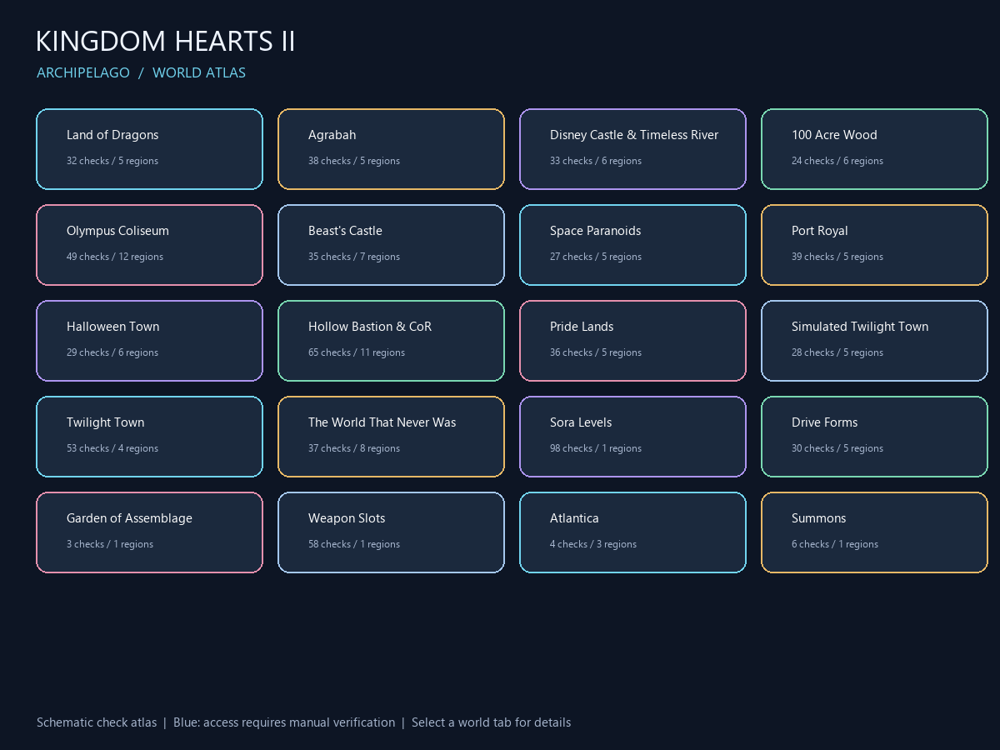

# Kingdom Hearts II – Archipelago PopTracker-Pack

Ein Check-Atlas für KH2 Final Mix auf Basis von Archipelago 0.6.7 / KH2 World 2.0.0.

**[Pack v0.1.4 herunterladen](dist/kh2-ap-poptracker-0.1.4.zip)** und das ZIP in
PopTracker ziehen. Enthalten sind 293 Itemtypen, 724 Checks, 102 Bereiche,
21 schematische Karten sowie AP-Inventar-/Check-Tracking. 176 Itemtypen besitzen
zugeordnete Grafiken: 40 KH2Tracker-Icons und 136 zusätzliche Originalbilder aus
einer lokalen OpenKH-Extraktion. 115 weitere Itemtypen verwenden gemeinsam
genutzte Original-Menü-/Kategorie-Icons. Max HP Up und Max MP Up verwenden die
neu gerenderten Textsymbole **HP ↑** und **MP ↑** entsprechend der bestätigten
Ingame-Darstellung. Es verbleiben keine generischen Platzhalter.

**[Asset-Liste: 117 ohne individuelle Grafik, davon 115 mit Kategorie-Icons](kh2-ap-poptracker/MISSING-ASSETS.md)**

Die vollständige Kampf-, Visit-Lock- und Form-Level-Zugangslogik ist noch nicht
implementiert. Ungeprüfte Bereiche erscheinen blau. Ein echter Multiworld-Test
gegen ap.dsatool.org steht noch aus; Format und AP-Callbacks wurden lokal geprüft.

- [Installation, Funktionsumfang und Quellen](kh2-ap-poptracker/README.md)
- [Generator und Validierung](BUILD.md)
- `sources/kh2`: gepinnte AP-Quelldaten mit Prüfsummen im Pack.
- `tools/schema`: offizielle PopTracker-Schemas samt Lizenz.

Die eingebundenen Icons stammen aus Red-Buddha/KH2Tracker; dieses Projekt nennt
Spielgrafiken und Televo als Grafikquellen. Lizenz und Herkunftsbelege sind im
Pack enthalten. Spieldateien sind nicht enthalten.
Die zusätzlichen Itembilder wurden mit OpenKH als transparente PNGs exportiert.
`data/game-assets.json` dokumentiert Spiel-ID, Picture-ID und Quellprüfsummen.
BAR-, IMD-, DDS-Dateien und vollständige Spielarchive sind nicht enthalten.
Die Kategorie-Icons stammen aus `msg/us/fontimage.bar` und folgen der
[OpenKH-Icon-Tabelle](https://openkh.dev/kh2/dictionary/icons.html).
`data/menu-assets.json` kennzeichnet jede Zuordnung ausdrücklich als gemeinsam
genutztes Symbol, einschließlich der transparenten 24×24-Ausschnitte.
